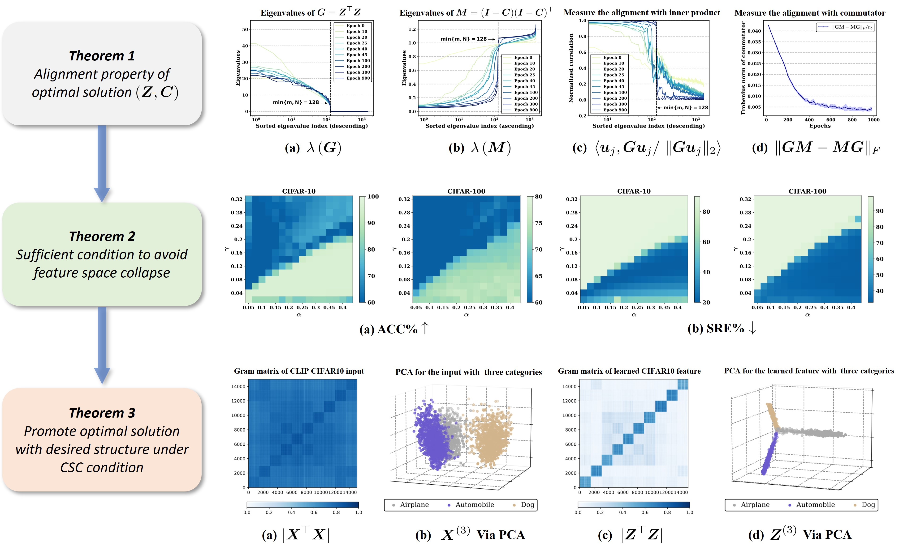

# Exploring a Principled Framework for Deep Subspace Clustering

<!--  -->

[](https://paperswithcode.com/sota/image-clustering-on-tiny-imagenet?p=exploring-a-principled-framework-for-deep-1)
[](https://paperswithcode.com/sota/image-clustering-on-cifar-10?p=exploring-a-principled-framework-for-deep-1)
[](https://paperswithcode.com/sota/image-clustering-on-cifar-100?p=exploring-a-principled-framework-for-deep-1)
[](https://paperswithcode.com/sota/unsupervised-image-classification-on-cifar-20?p=exploring-a-principled-framework-for-deep-1)
[](https://paperswithcode.com/sota/image-clustering-on-imagenet?p=exploring-a-principled-framework-for-deep-1)
[](https://paperswithcode.com/sota/image-clustering-on-imagenet-dog-15?p=exploring-a-principled-framework-for-deep-1)

<p align="center">
    

## Outlines
- [💥 News 💥](https://github.com/mengxianghan123/PRO-DSC?tab=readme-ov-file#-news-)
- [👀 About PRO-DSC](https://github.com/mengxianghan123/PRO-DSC?tab=readme-ov-file#-about-pro-dsc)
- [Clustering on the CLIP Features](https://github.com/mengxianghan123/PRO-DSC?tab=readme-ov-file#clustering-on-the-clip-features)
- [Clustering on Classical Subspace Clustering Benchmarks](https://github.com/mengxianghan123/PRO-DSC?tab=readme-ov-file#clustering-on-classical-subspace-clustering-benchmarks)
- [📜 License](https://github.com/mengxianghan123/PRO-DSC?tab=readme-ov-file#-license)
<!-- - [🤝 Contributors]() -->

## 💥 News 💥
  **[2025.1.23]** Our paper is accepted by ICLR 2025! The paper is now accessible at [Openreview](https://openreview.net/forum?id=7psWohxvxp) and [arXiv](https://arxiv.org/abs/2503.17288).
  

## 👀 About PRO-DSC
<!-- Subspace clustering is a classical unsupervised learning task, built on a basic assumption that high-dimensional data can be approximated by a union of subspaces (UoS). Nevertheless, the real-world data are often deviating from the UoS assumption. To address this challenge, state-of-the-art deep subspace clustering algorithms attempt to jointly learn UoS representations and self-expressive coefficients. However, the general framework of the existing algorithms suffers from feature collapse and lacks a theoretical guarantee to learn desired UoS representation.  -->
PRO-DSC (Principled fRamewOrk for Deep Subspace Clustering) is designed to learn structured representations and self-expressive coefficients in a unified manner. Specifically, in PRO-DSC, we incorporate an effective regularization on the learned representations into the self-expressive model, and prove that the regularized self-expressive model is able to prevent feature space collapse and the learned optimal representations under certain condition lie on a union of orthogonal subspaces. 
<!-- Moreover, we provide a scalable and efficient approach to implement our PRO-DSC and conduct extensive experiments to verify our theoretical findings and demonstrate the superior performance of our proposed deep subspace clustering approach. -->

## Clustering on the CLIP Features
Step 1: Download the extracted CLIP features from [here](https://drive.google.com/drive/folders/1L9jH8zRF3To6Hb_B0UZ6PbknhgusWm5_?usp=drive_link) and put them under `./data/datasets`

Step 2: Train PRO-DSC by running:

```sh
python main.py --data cifar10/cifar100/cifar20/tinyimagenet/imagenet/imagenetdogs
```

## Clustering on Classical Subspace Clustering Benchmarks
Step 1: Download the datasets from [here](https://drive.google.com/drive/folders/1C4qlqYOW4-YulIwgkNfqMM7dZ2O5-BK_?usp=sharing) and put them under `./data/datasets`

Step 2: Train PRO-DSC by running:

```sh
python main_subspace.py --data eyaleb/orl/coil100
```


## 📜 License

Our code is distributed under the [CC BY-NC 4.0](https://creativecommons.org/licenses/by-nc/4.0/) license.


## :white_check_mark: Cite

If you find **PRO-DSC** useful for your your research and applications, please kindly cite using this BibTeX:

```bibtex
@inproceedings{
PRO-DSC-ICLR2025,
title={Exploring a Principled Framework for Deep Subspace Clustering},
author={Meng, Xianghan and Huang, Zhiyuan and He, Wei and Qi, Xianbiao and Xiao, Rong and Li, Chun-Guang},
booktitle={The Thirteenth International Conference on Learning Representations},
year={2025},
url={https://openreview.net/forum?id=7psWohxvxp}
}

```
